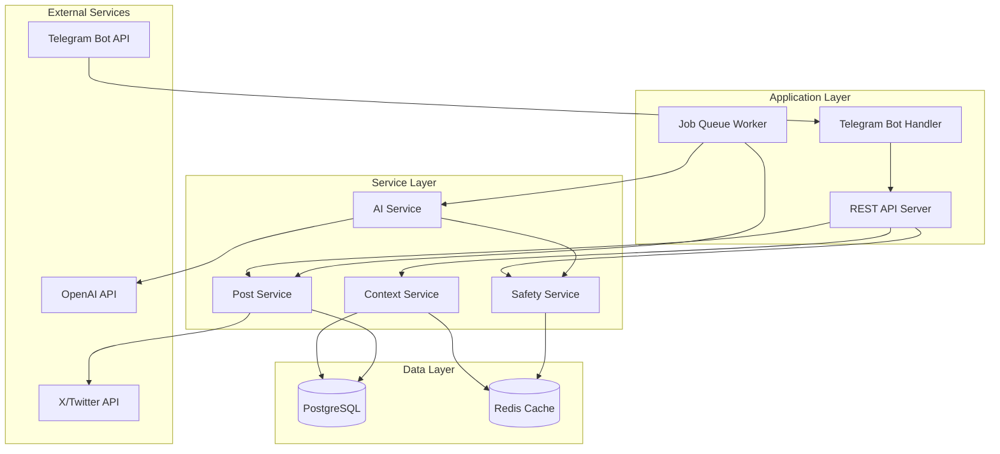
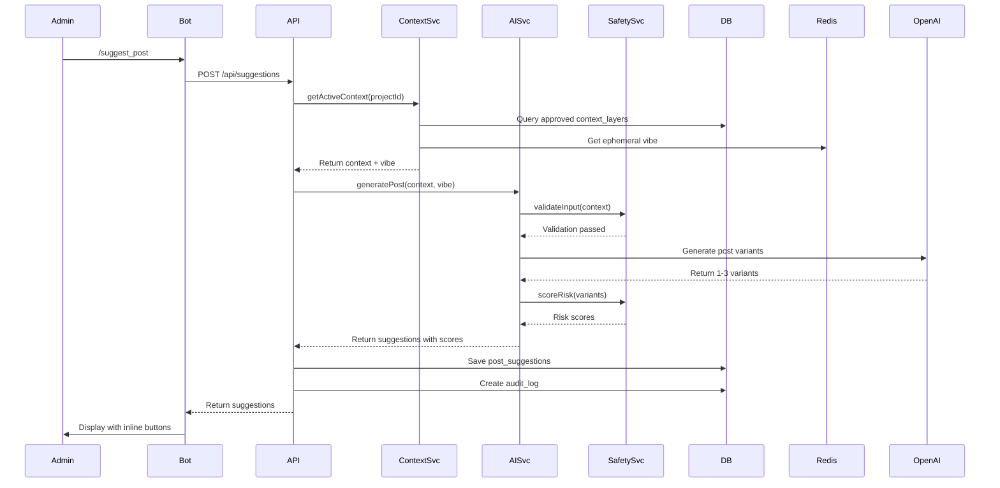
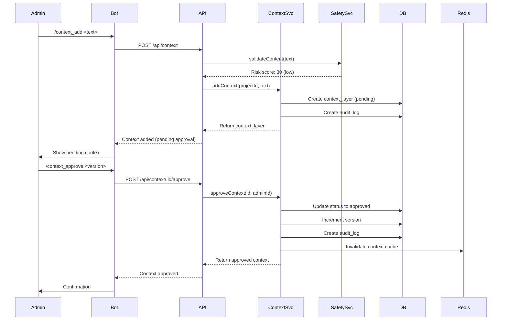
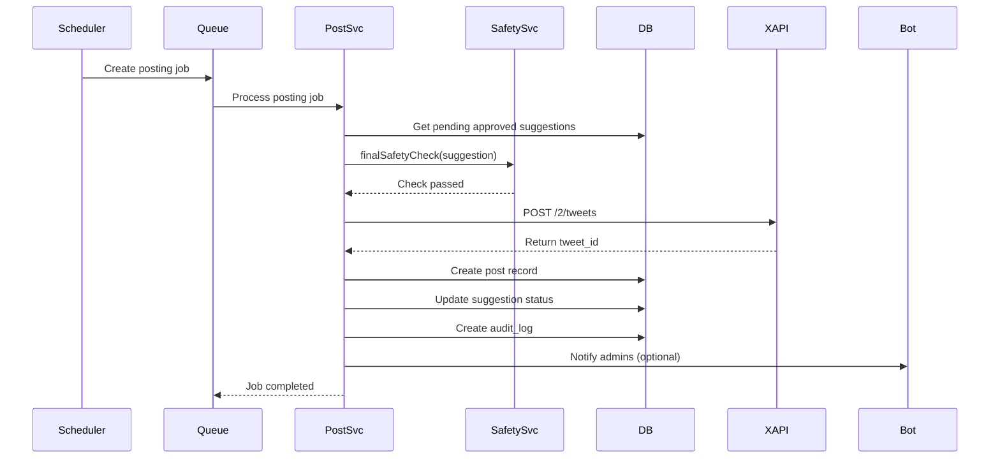
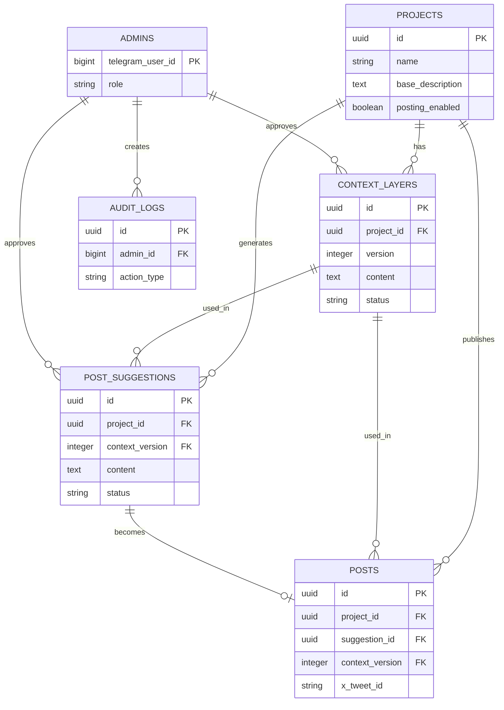

# System Architecture Blueprint

## Overview

This document describes the system architecture for MemeBot, including component interactions, data flows, failover strategies, and scaling approaches.

---

## High-Level Architecture



---

## Component Architecture

### Telegram Bot Handler

**Responsibility:** Handle all Telegram interactions

**Components:**
- Command parser
- Inline keyboard handler
- Message formatter
- Admin authentication

**Technology:** `telegraf.js`

**Key Features:**
- Webhook mode (production) or long polling (development)
- Command routing
- Callback query handling
- Error handling and retries

---

### REST API Server

**Responsibility:** Core business logic and API endpoints

**Components:**
- Project management endpoints
- Context management endpoints
- Post suggestion endpoints
- Admin management endpoints
- Audit logging

**Technology:** Express.js with TypeScript

**Key Features:**
- RESTful API design
- Input validation (Zod)
- Error handling middleware
- Rate limiting middleware
- Authentication middleware

---

### Job Queue Worker

**Responsibility:** Async job processing

**Components:**
- Post generation jobs
- Posting jobs
- Cleanup jobs
- Scheduled tasks

**Technology:** Bull (Redis-based)

**Key Features:**
- Job prioritization
- Retry logic with exponential backoff
- Job status tracking
- Failure handling

---

### Service Layer

#### Context Service

**Responsibility:** Manage versioned context layers

**Functions:**
- Add context layers
- Approve/reject context
- Retrieve active context
- Version management
- Rollback functionality

**Dependencies:**
- PostgreSQL (persistent storage)
- Redis (caching)

---

#### AI Service

**Responsibility:** Generate post suggestions using AI

**Functions:**
- Compose prompts
- Call OpenAI API
- Generate multiple variants
- Apply safety rules
- Format responses

**Dependencies:**
- OpenAI API
- Safety Service
- Context Service

---

#### Post Service

**Responsibility:** Manage post suggestions and publishing

**Functions:**
- Create post suggestions
- Approve/reject suggestions
- Post to X/Twitter
- Track post status
- Handle posting errors

**Dependencies:**
- X/Twitter API
- PostgreSQL
- Job Queue

---

#### Safety Service

**Responsibility:** Content moderation and safety checks

**Functions:**
- Risk scoring
- PII detection
- Keyword filtering
- Content moderation API calls
- Safety rule enforcement

**Dependencies:**
- OpenAI Moderation API
- Presidio (PII detection)
- Redis (caching)

---

## Data Flow Diagrams

### Post Generation Flow



### Context Approval Flow



### Autonomous Posting Flow



---

## Database Schema Relationships



---

## Caching Strategy

### Redis Cache Structure

**Context Layers:**
- Key: `context:project:{projectId}:active`
- Value: JSON of active context layers
- TTL: 1 hour (invalidated on update)

**Ephemeral Vibe:**
- Key: `vibe:project:{projectId}`
- Value: JSON of vibe data
- TTL: 7 days

**Rate Limiting:**
- Key: `ratelimit:{service}:{identifier}`
- Value: Counter
- TTL: Window duration (15 min, 1 hour, etc.)

**Job Status:**
- Key: `job:{jobId}:status`
- Value: Job status JSON
- TTL: 24 hours

---

## Failover and Redundancy Planning

### Application Layer

**Strategy:** Horizontal scaling with load balancer

**Implementation:**
- Multiple application server instances
- Stateless application design
- Load balancer (Nginx or cloud provider)
- Health check endpoints

**Failover:**
- Automatic health checks
- Remove unhealthy instances
- Session affinity not required (stateless)

---

### Database Layer

**Strategy:** Primary-replica setup

**Implementation:**
- Primary database for writes
- Read replicas for reads
- Automatic failover (PostgreSQL streaming replication)
- Connection pooling (Prisma)

**Failover:**
- Automatic promotion of replica to primary
- Update connection strings
- Monitor replication lag

**Backup:**
- Daily automated backups
- Point-in-time recovery
- Backup encryption
- Tested restore procedures

---

### Cache Layer

**Strategy:** Redis cluster or managed Redis

**Implementation:**
- Redis cluster for high availability
- Or managed Redis (Redis Cloud, Upstash)
- Automatic failover
- Data persistence (AOF or RDB)

**Failover:**
- Automatic failover in cluster mode
- Client reconnection logic
- Graceful degradation (continue without cache)

---

### External API Failures

**Telegram API:**
- Retry with exponential backoff
- Queue messages if API down
- Notify admins of extended outages

**X API:**
- Retry with exponential backoff
- Queue posts for later
- Monitor rate limits
- Fallback to manual posting

**OpenAI API:**
- Retry with exponential backoff
- Fallback to cheaper models
- Cache similar prompts
- Queue requests if rate limited

---

## Scaling Strategy

### Horizontal Scaling

**Application Servers:**
- Stateless design enables easy horizontal scaling
- Add instances behind load balancer
- Auto-scaling based on CPU/memory metrics

**Database:**
- Read replicas for read scaling
- Connection pooling to manage connections
- Query optimization and indexing

**Cache:**
- Redis cluster for distributed caching
- Sharding if needed
- Cache warming strategies

---

### Vertical Scaling

**When to Use:**
- Before horizontal scaling
- For development/staging
- Cost optimization for low traffic

**Limitations:**
- Single point of failure
- Limited scalability
- Not suitable for production at scale

---

### Multi-Project Scaling

**Isolation:**
- Database partitioning by project_id
- Separate queues per project (optional)
- Project-specific rate limits

**Resource Management:**
- Per-project quotas
- Usage tracking
- Cost allocation

---

## Performance Optimization

### Database Optimization

1. **Indexing:**
   - Index on frequently queried columns
   - Composite indexes for common queries
   - Regular index maintenance

2. **Query Optimization:**
   - Use EXPLAIN ANALYZE
   - Avoid N+1 queries (Prisma includes)
   - Batch operations where possible

3. **Connection Pooling:**
   - Prisma connection pooling
   - Appropriate pool size
   - Monitor connection usage

---

### Caching Optimization

1. **Cache Warming:**
   - Pre-load frequently accessed data
   - Cache context layers on approval
   - Cache project configurations

2. **Cache Invalidation:**
   - Invalidate on updates
   - TTL for time-sensitive data
   - Version-based cache keys

3. **Cache Strategy:**
   - Cache-aside pattern
   - Write-through for critical data
   - Cache preloading for hot data

---

### API Optimization

1. **Request Batching:**
   - Batch Telegram API calls where possible
   - Batch database queries
   - Reduce round trips

2. **Async Processing:**
   - Queue long-running tasks
   - Background job processing
   - Non-blocking operations

3. **Response Caching:**
   - Cache API responses
   - ETag support for conditional requests
   - CDN for static assets

---

## Monitoring and Observability

### Metrics

**Application Metrics:**
- Request rate
- Response times (p50, p95, p99)
- Error rates
- Queue depths

**Business Metrics:**
- Posts generated per day
- Approval rate
- Context update frequency
- Active projects

**Infrastructure Metrics:**
- CPU usage
- Memory usage
- Database connections
- Cache hit rate

---

### Logging

**Structured Logging:**
- JSON format
- Log levels (error, warn, info, debug)
- Correlation IDs
- Contextual information

**Log Aggregation:**
- Centralized logging (Logtail, Papertrail)
- Search and filtering
- Retention policies
- Alerting on errors

---

### Alerting

**Critical Alerts:**
- Service down
- Database connection failures
- High error rates (>5%)
- Safety violations

**Warning Alerts:**
- Rate limit approaching
- High response times
- Queue backup
- Disk space low

**Informational:**
- Deployments
- Configuration changes
- Scheduled maintenance

---

## Security Architecture

### Network Security

- TLS 1.3 for all communications
- VPN for database access (if self-hosted)
- Firewall rules
- DDoS protection

### Application Security

- Input validation
- SQL injection prevention (Prisma)
- XSS prevention
- CSRF protection (if web interface)
- Rate limiting
- Authentication and authorization

### Data Security

- Encryption at rest (database)
- Encryption in transit (TLS)
- Secret management (environment variables)
- Access controls
- Audit logging

---

## Deployment Architecture

### Development Environment

```
Local Machine
├── Docker Compose
│   ├── PostgreSQL (local)
│   ├── Redis (local)
│   └── Application (nodemon)
└── Environment: .env.local
```

### Staging Environment

```
Cloud Provider (Railway/Render)
├── Application Server
├── PostgreSQL (managed)
├── Redis (managed)
└── Environment: Staging config
```

### Production Environment

```
Cloud Provider
├── Load Balancer
├── Application Servers (multiple)
├── PostgreSQL (primary + replicas)
├── Redis Cluster
├── Monitoring Stack
└── Backup System
```

---

## Technology Decisions

### Why Node.js + TypeScript?

- Excellent Telegram bot ecosystem
- Fast development cycle
- Type safety with TypeScript
- Strong async/await support
- Rich npm ecosystem

### Why PostgreSQL?

- ACID compliance
- JSONB for flexible data
- Excellent performance
- Strong ecosystem
- Prisma ORM support

### Why Redis?

- Fast in-memory storage
- Built-in data structures
- Pub/sub capabilities
- Perfect for caching and queues

### Why Bull?

- Redis-based (already in stack)
- TypeScript support
- Job prioritization
- Built-in monitoring
- Retry logic

---

## Future Architecture Considerations

### Microservices Migration

**If Needed:**
- Separate services for:
  - Bot handler
  - API server
  - AI service
  - Posting service
- Service mesh (Istio, Linkerd)
- API gateway
- Service discovery

### Event-Driven Architecture

**If Needed:**
- Event bus (Redis pub/sub or RabbitMQ)
- Event sourcing for audit logs
- CQRS pattern
- Event replay capability

---

## References

- [Prisma Best Practices](https://www.prisma.io/docs/guides/performance-and-optimization)
- [Redis Best Practices](https://redis.io/docs/manual/patterns/)
- [Node.js Production Best Practices](https://github.com/goldbergyoni/nodebestpractices)
- [PostgreSQL High Availability](https://www.postgresql.org/docs/current/high-availability.html)

