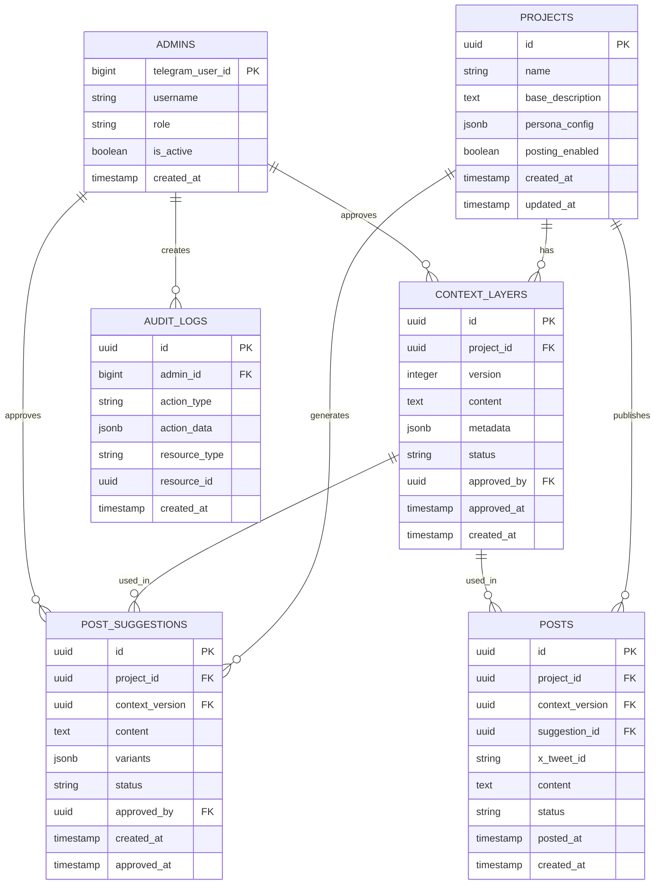
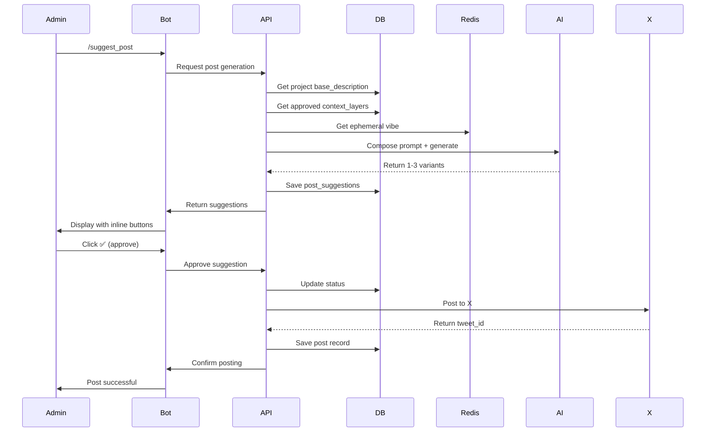
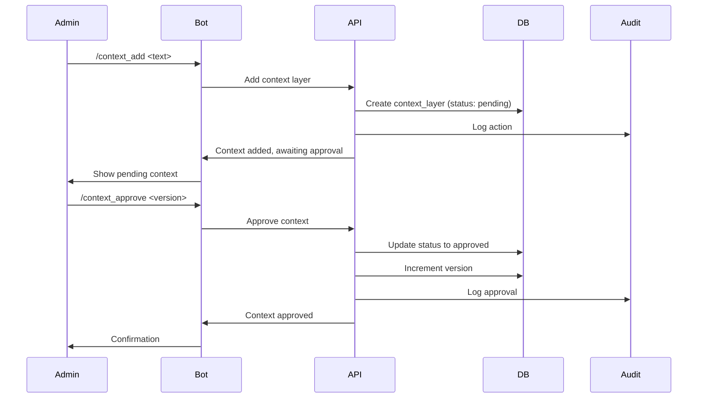

# Technical Specification Document

## Overview

This document provides detailed technical specifications for MemeBot, including API integrations, database schema, authentication, and rate limiting strategies.

---

## API Specifications

### Telegram Bot API

**Version:** Bot API 6.0+

**Base URL:** `https://api.telegram.org/bot{token}/`

**Key Endpoints:**
- `getUpdates` - Long polling for messages
- `setWebhook` - Webhook configuration
- `sendMessage` - Send text messages
- `editMessageText` - Edit sent messages
- `sendPhoto` - Send images
- `answerCallbackQuery` - Handle inline button clicks

**Rate Limits:**
- **Messages:** 30 messages per second per bot
- **GetUpdates:** 1 request per second
- **Global:** 20 requests per second

**Authentication:**
- Bot token from @BotFather
- Token stored in environment variable
- Never exposed in client-side code

**Library:** `telegraf.js` v4.15.0+

**Implementation Notes:**
- Use webhook mode for production (lower latency)
- Use long polling for development
- Implement retry logic with exponential backoff
- Handle rate limit errors gracefully

---

### X (Twitter) API

**Version:** API v2

**Base URL:** `https://api.twitter.com/2/`

**Key Endpoints:**
- `POST /2/tweets` - Create tweet
- `GET /2/tweets/:id` - Retrieve tweet
- `DELETE /2/tweets/:id` - Delete tweet
- `GET /2/users/me` - Get authenticated user info

**Authentication:**
- OAuth 2.0 with PKCE
- Client credentials flow for app-only access
- User context required for posting

**Rate Limits (Essential Tier):**
- **Tweet Creation:** 1,500 tweets per 15 minutes
- **Tweet Reading:** 300 requests per 15 minutes
- **User Lookup:** 300 requests per 15 minutes

**Rate Limits (Elevated Tier):**
- **Tweet Creation:** 3,000 tweets per 15 minutes
- **Tweet Reading:** 1,500 requests per 15 minutes

**Library:** `twitter-api-v2` v1.15.0+

**Implementation Notes:**
- Store OAuth tokens securely
- Implement token refresh logic
- Monitor rate limit headers
- Queue posts if rate limit approached

---

### OpenAI API

**Version:** v1

**Base URL:** `https://api.openai.com/v1/`

**Key Endpoints:**
- `POST /chat/completions` - Generate text with GPT-4
- `POST /moderations` - Content moderation

**Models:**
- **Primary:** `gpt-4-turbo-preview` or `gpt-4`
- **Fallback:** `gpt-3.5-turbo` (if GPT-4 unavailable)

**Rate Limits:**
- **Tier 1:** 500 requests per minute, 40,000 tokens per minute
- **Tier 2:** 3,500 requests per minute, 90,000 tokens per minute
- **Tier 3:** 10,000 requests per minute, 1,000,000 tokens per minute

**Authentication:**
- API key in `Authorization` header
- Key stored in environment variable
- Rotate keys periodically

**Library:** `openai` v4.20.0+

**Implementation Notes:**
- Implement streaming for better UX (optional)
- Cache similar prompts to reduce costs
- Monitor token usage
- Implement fallback to cheaper models if needed

---

## Database Schema

### Entity Relationship Diagram

### Table Specifications

#### projects

Stores base project information and configuration.

| Column | Type | Constraints | Description |
|--------|------|-------------|-------------|
| `id` | UUID | PRIMARY KEY, DEFAULT gen_random_uuid() | Unique project identifier |
| `name` | VARCHAR(255) | NOT NULL | Project name |
| `base_description` | TEXT | NOT NULL | Base persona description |
| `persona_config` | JSONB | | Persona configuration (emoji usage, tone, etc.) |
| `posting_enabled` | BOOLEAN | DEFAULT false | Autonomous posting toggle |
| `created_at` | TIMESTAMP | DEFAULT NOW() | Creation timestamp |
| `updated_at` | TIMESTAMP | DEFAULT NOW() | Last update timestamp |

**Indexes:**
- `idx_projects_name` on `name`
- `idx_projects_posting_enabled` on `posting_enabled`

---

#### context_layers

Versioned context layers for each project.

| Column | Type | Constraints | Description |
|--------|------|-------------|-------------|
| `id` | UUID | PRIMARY KEY, DEFAULT gen_random_uuid() | Unique layer identifier |
| `project_id` | UUID | FOREIGN KEY → projects.id | Associated project |
| `version` | INTEGER | NOT NULL | Version number (incremental) |
| `content` | TEXT | NOT NULL | Context layer content |
| `metadata` | JSONB | | Additional metadata (source, tags, etc.) |
| `status` | VARCHAR(50) | DEFAULT 'pending' | Status: pending, approved, reverted |
| `approved_by` | BIGINT | FOREIGN KEY → admins.telegram_user_id | Approving admin |
| `approved_at` | TIMESTAMP | | Approval timestamp |
| `created_at` | TIMESTAMP | DEFAULT NOW() | Creation timestamp |

**Indexes:**
- `idx_context_layers_project_version` on `(project_id, version)` UNIQUE
- `idx_context_layers_status` on `status`
- `idx_context_layers_created_at` on `created_at`

**Constraints:**
- Unique constraint on `(project_id, version)`
- Version must be > 0

---

#### post_suggestions

AI-generated post suggestions awaiting approval.

| Column | Type | Constraints | Description |
|--------|------|-------------|-------------|
| `id` | UUID | PRIMARY KEY, DEFAULT gen_random_uuid() | Unique suggestion identifier |
| `project_id` | UUID | FOREIGN KEY → projects.id | Associated project |
| `context_version` | INTEGER | NOT NULL | Context version used |
| `content` | TEXT | NOT NULL | Primary suggestion content |
| `variants` | JSONB | | Array of alternative variants (1-3) |
| `status` | VARCHAR(50) | DEFAULT 'pending' | Status: pending, approved, rejected, edited |
| `approved_by` | BIGINT | FOREIGN KEY → admins.telegram_user_id | Approving admin |
| `created_at` | TIMESTAMP | DEFAULT NOW() | Creation timestamp |
| `approved_at` | TIMESTAMP | | Approval timestamp |

**Indexes:**
- `idx_post_suggestions_project_status` on `(project_id, status)`
- `idx_post_suggestions_created_at` on `created_at`

---

#### posts

Published posts with full context tracking.

| Column | Type | Constraints | Description |
|--------|------|-------------|-------------|
| `id` | UUID | PRIMARY KEY, DEFAULT gen_random_uuid() | Unique post identifier |
| `project_id` | UUID | FOREIGN KEY → projects.id | Associated project |
| `context_version` | INTEGER | NOT NULL | Context version used |
| `suggestion_id` | UUID | FOREIGN KEY → post_suggestions.id | Original suggestion |
| `x_tweet_id` | VARCHAR(50) | UNIQUE | X/Twitter tweet ID |
| `content` | TEXT | NOT NULL | Published content |
| `status` | VARCHAR(50) | DEFAULT 'posted' | Status: posted, deleted, failed |
| `posted_at` | TIMESTAMP | | Posting timestamp |
| `created_at` | TIMESTAMP | DEFAULT NOW() | Creation timestamp |

**Indexes:**
- `idx_posts_project_posted_at` on `(project_id, posted_at)`
- `idx_posts_x_tweet_id` on `x_tweet_id` UNIQUE
- `idx_posts_status` on `status`

---

#### admins

Telegram admin users with roles and permissions.

| Column | Type | Constraints | Description |
|--------|------|-------------|-------------|
| `telegram_user_id` | BIGINT | PRIMARY KEY | Telegram user ID |
| `username` | VARCHAR(255) | | Telegram username |
| `role` | VARCHAR(50) | DEFAULT 'admin' | Role: admin, super_admin |
| `is_active` | BOOLEAN | DEFAULT true | Active status |
| `created_at` | TIMESTAMP | DEFAULT NOW() | Creation timestamp |

**Indexes:**
- `idx_admins_role` on `role`
- `idx_admins_is_active` on `is_active`

---

#### audit_logs

Comprehensive audit trail for all actions.

| Column | Type | Constraints | Description |
|--------|------|-------------|-------------|
| `id` | UUID | PRIMARY KEY, DEFAULT gen_random_uuid() | Unique log identifier |
| `admin_id` | BIGINT | FOREIGN KEY → admins.telegram_user_id | Admin who performed action |
| `action_type` | VARCHAR(100) | NOT NULL | Action type (e.g., 'context_approved', 'post_created') |
| `action_data` | JSONB | | Action-specific data |
| `resource_type` | VARCHAR(50) | | Resource type (project, context_layer, post, etc.) |
| `resource_id` | UUID | | Resource identifier |
| `created_at` | TIMESTAMP | DEFAULT NOW() | Action timestamp |

**Indexes:**
- `idx_audit_logs_admin_created` on `(admin_id, created_at)`
- `idx_audit_logs_resource` on `(resource_type, resource_id)`
- `idx_audit_logs_action_type` on `action_type`
- `idx_audit_logs_created_at` on `created_at` (for retention policies)

**Retention:** 1 year minimum, archived after

---

## Authentication & Authorization

### Admin Authentication

**Method:** Telegram User ID verification

**Flow:**
1. User sends command to bot
2. Bot extracts `from.id` from Telegram message
3. System checks if user exists in `admins` table
4. If not exists, user is denied access
5. If exists and `is_active = true`, access granted

**Roles:**
- **admin:** Standard admin privileges
  - View/approve context layers
  - Approve/reject post suggestions
  - Toggle posting mode
  - View audit logs

- **super_admin:** All admin privileges plus:
  - Add/remove admins
  - Emergency stop
  - System configuration
  - Full audit log access

### API Authentication

**Telegram Bot:**
- Bot token authentication
- Token in environment variable
- Webhook secret validation (if using webhooks)

**X API:**
- OAuth 2.0 with PKCE
- Access token and refresh token stored encrypted
- Token refresh before expiration

**OpenAI API:**
- API key in `Authorization` header
- Key stored in environment variable
- Organization ID for usage tracking

---

## Rate Limiting & Quota Management

### Telegram API Rate Limiting

**Strategy:** Token bucket algorithm

**Limits:**
- 30 messages per second
- 1 getUpdates per second
- 20 requests per second (global)

**Implementation:**
- Redis-based rate limiter
- Per-bot token bucket
- Exponential backoff on rate limit errors

**Monitoring:**
- Track requests per second
- Alert at 80% capacity
- Queue messages if limit approached

---

### X API Rate Limiting

**Strategy:** Sliding window with Redis

**Limits (Essential Tier):**
- 1,500 tweets per 15 minutes
- 300 read requests per 15 minutes

**Implementation:**
- Track requests in Redis with TTL
- Check limits before API calls
- Queue posts if limit approached
- Priority queue for urgent posts

**Monitoring:**
- Track remaining quota
- Alert at 20% remaining
- Automatic queue management

---

### OpenAI API Rate Limiting

**Strategy:** Token-based limiting

**Limits (Tier 1):**
- 500 requests per minute
- 40,000 tokens per minute

**Implementation:**
- Track both request count and token usage
- Estimate tokens before API call
- Queue requests if limit approached
- Fallback to cheaper models if needed

**Cost Optimization:**
- Cache similar prompts
- Use streaming for better UX
- Monitor token usage per project

---

### Internal Rate Limiting

**User Actions:**
- 10 context additions per hour per admin
- 50 post suggestions per hour per project
- 100 commands per hour per admin

**Implementation:**
- Redis-based counters with TTL
- Per-user, per-project limits
- Graceful degradation on limit

---

## Data Flow

### Post Generation Flow

### Context Management Flow

---

## Error Handling

### API Error Categories

1. **Rate Limit Errors:**
   - Retry with exponential backoff
   - Queue request for later
   - Notify admin if persistent

2. **Authentication Errors:**
   - Log security event
   - Alert admins
   - Block suspicious activity

3. **Validation Errors:**
   - Return user-friendly message
   - Log for debugging
   - No retry needed

4. **Network Errors:**
   - Retry up to 3 times
   - Exponential backoff
   - Fallback to cached data if available

5. **Database Errors:**
   - Log with full context
   - Alert immediately
   - Rollback transaction if applicable

---

## Security Considerations

1. **Input Validation:**
   - Validate all user inputs
   - Sanitize text content
   - Check for injection attempts

2. **Secrets Management:**
   - Never commit secrets
   - Use environment variables
   - Rotate keys periodically

3. **SQL Injection Prevention:**
   - Use parameterized queries (Prisma handles this)
   - Never concatenate user input

4. **XSS Prevention:**
   - Sanitize all output
   - Use Telegram's built-in escaping

5. **Rate Limiting:**
   - Prevent abuse
   - Protect API quotas
   - DDoS mitigation

---

## Performance Targets

- **Post Generation:** < 5 seconds (AI API dependent)
- **Database Queries:** < 100ms (p95)
- **Telegram Response:** < 1 second
- **X Posting:** < 2 seconds
- **Context Retrieval:** < 50ms (with caching)

---

## References

- [Telegram Bot API Documentation](https://core.telegram.org/bots/api)
- [X API v2 Documentation](https://developer.twitter.com/en/docs/twitter-api)
- [OpenAI API Documentation](https://platform.openai.com/docs)
- [PostgreSQL JSONB Documentation](https://www.postgresql.org/docs/current/datatype-json.html)

